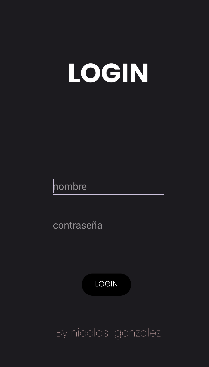
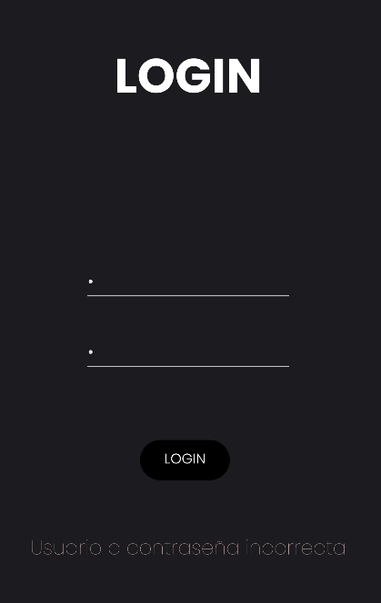
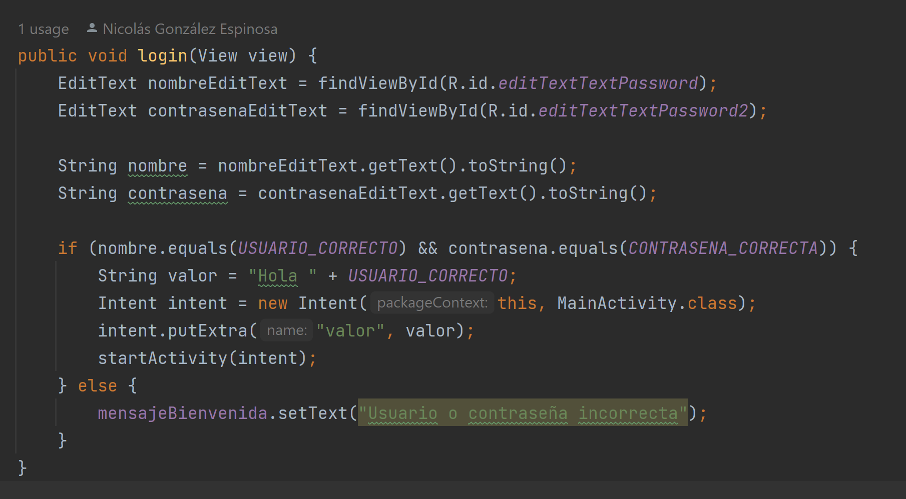

Proyecto de Interfaz en Android Studio

Lo primero a entender en Android Studio es a fijar un elemento según los límites de la pantalla. 

También se puede especificar los píxeles a los que estará determinado elemento. 

Es importante personalizar los textos mediante la pestaña Attributes, en la que cambiar el tamaño, fuente, color...

Proyecto de Login en Android Studio

Añado la pantalla login, desde la que se accederá al contador. EditTextTextPassword fue bastante útil, así como los ya conocidos Constrain para poner cada cosa en su sitio. 

Recalco, que al tener un nombre o contraseña erróneo, se ve reflejado en la aplicación. 

Esta es la parte que más lógica tiene, las palabras clave: intent y StartActivity serán muy importantes en el desarrollo Android. Así que debo tenerlas en cuenta. 

