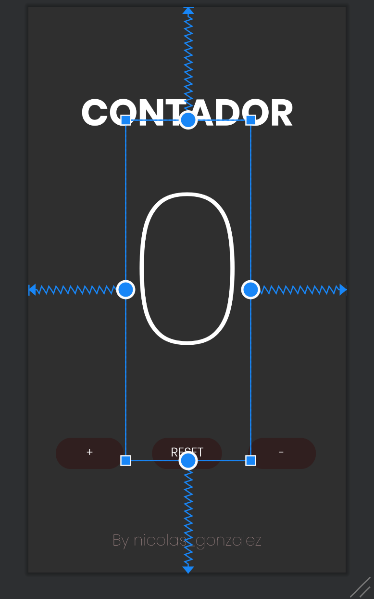

Proyecto de interfaz en Android Studio

Lo primero a entender en Android Studio es a fijar un elemento según los límites de la pantalla. 

También se puede especificar los píxeles a los que estará determinado elemento. 

Es importante personalizar los textos mediante la pestaña Attributes, en la que cambiar el tamaño, fuente, color...

